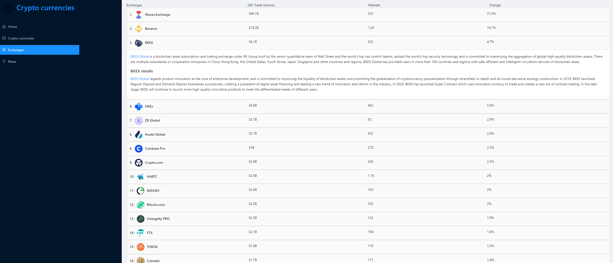

# crypto-currency-toolkit
Crypto currency dashboard using [Redux Toolkit](https://redux-toolkit.js.org/) including [RTK Query](https://redux-toolkit.js.org/rtk-query/overview). [Rapid API](https://rapidapi.com/) and [Ant Design](https://ant.design/).

  
  
  
  

# Config
make sure there is `.env` file in this same folder as package.json and following properties are set in it.  
  
CRYPTO_API_TOKEN=  
CRYPTO_NEWS_API_TOKEN=  
  
